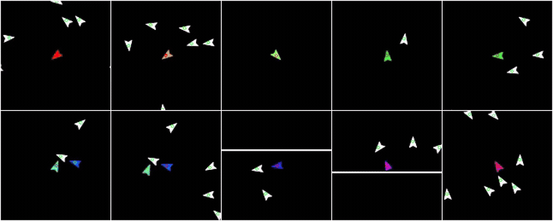
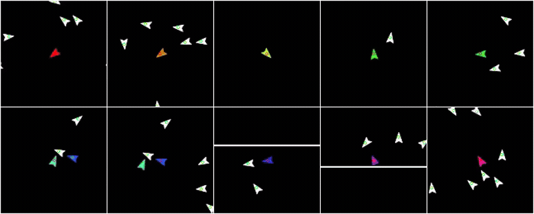

# FlockWorld

**A multi-agent world model of an egocentric flocking simulation.**

Ten agents fly in one shared arena, each seeing only its own egocentric crop. A
single generative video model predicts all ten views jointly — and the question
this repository is built to answer is whether those ten views stay *mutually
consistent*: when agent 3 sees agent 7 off to its left, does agent 7's own view
agree that agent 3 is off to its right?

📄 **Paper:** _to appear_ · 🎬 [Rollouts](#rollouts) · 🧪 [Experiments](#experiments) · 📊 [Reproducing the paper](#reproducing-the-paper)

---

## Rollouts

> Ten egocentric views of one shared arena, generated autoregressively for 10
> seconds from two context frames.

**Ground truth** — the simulation itself, run through the frozen autoencoder the
world model predicts in. Nothing is generated here; this is the best anything in
this latent space can look.



**FlockDiT** (diffusion forcing, experiment 3) — generated. Two context frames
in, 297 frames out, with the agents' recorded accelerations replayed as actions.



Each tile is one camera agent's own 128x128 crop, upscaled 2x — not a slice of
one global image. The colored boid near the center of a tile is that tile's
agent; the other nine keep their hues wherever they show up, so agent 3's red
can be followed through agent 7's view. White boids are the 90 ambient boids,
which have no viewpoint of their own. The white lines are arena walls.

Full-quality MP4s: [ground truth](docs/media/rollout_ground_truth.mp4) ·
[FlockDiT](docs/media/rollout_flockdit_df.mp4). Both show held-out episode
`65e69251`; the GIFs are 12 fps, the MP4s 30.

---

## What's in here

| Part | Framework | Where |
|---|---|---|
| Flocking simulation, rendering, Gymnasium environment | JAX | `flockworld/` |
| Video autoencoder + FlockDiT world model + training | PyTorch | `modeling/` |
| Evaluation, metrics, probes, figure generation | NumPy/SciPy | `modeling/eval/`, root-level scripts |

Training data is **simulated on the fly** — there is no dataset to download.

## Installation

```bash
uv sync            # or: pip install -e .
```

Requires Python >= 3.13. On Windows JAX runs on CPU; on Linux both JAX and
PyTorch use CUDA 13 (`jax[cuda13]`, torch `cu130` wheels).

## Quick start

### 1. Look at the environment

Record a 30-second video with default settings:

```bash
python data_recording.py
```

Override any parameter via the CLI (OmegaConf dot-list syntax):

```bash
python data_recording.py boids.num_agents=100 canvas.width=512 canvas.height=512
python data_recording.py video.duration=5 video.fps=60 seed=123
python data_recording.py device=cpu
python data_recording.py video.chunk_size=64
python data_recording.py video.warmup=120
python data_recording.py generation.num_envs=8 video.duration=5
python data_recording.py trajectory.enabled=true
python data_recording.py collection.enabled=true collection.total_episodes=100 generation.num_envs=8 collection.partial_agents=2
```

Output videos are written to `output/full_obs.mp4` (entire canvas) and
`output/partial_obs.mp4` (square crop around the controlled agent). Multi-env
headless runs use `generation.*_path_template` and write one full/partial pair
per environment.
Set `trajectory.enabled=true` to also save per-frame state/action trajectories
as `.parquet`. Each row is one recorded frame, with agent fields stored in wide
columns like `a1_pos_x`, `a1_vel_x`, `a1_acc_x`, and `a1_acc_y`.

Structured collection mode writes a timestamped dataset under `outputs/` with
`settings.yaml`, `metadata.json`, `video_global/00000.mp4`,
`video_a1/00000.mp4`, additional partial-agent folders up to
`collection.partial_agents`, and per-episode trajectory files under
`trajectory/`.

### 2. Train

The world model predicts in the latent space of a frozen video autoencoder, so
training is two steps: train the VAE, then train FlockDiT on top of it.

```bash
# (a) video autoencoder, in the agent-color condition
uv run python train_vae.py --config config/train_vae_color_stream.yaml

# (b) world model — point cfg.vae.checkpoint_path at the VAE you just trained
uv run python train_flock_dit.py --config config/train_flockdit_latent_multi_stream.yaml
```

Single- vs multi-agent is selected by `data.num_agents` in the config. Both
entry points take OmegaConf dot-list overrides after the config path:

```bash
uv run python train_flock_dit.py --config config/train_flockdit.yaml \
    device=cpu dataloader.batch_size=1 train.epochs=1     # CPU smoke test
```

The streaming configs simulate fresh clips throughout training. To train from a
pre-recorded corpus instead, cache latents once with
`precompute_latents.py` and use one of the non-streaming configs.

### 3. Evaluate

```bash
# qualitative: tile all 10 rolled-out views into one grid video
uv run python eval_flock_multi.py --config <experiment.yaml> --mode overlay --source pred

# quantitative: per-view fidelity + cross-view consistency, with ceiling and floor
uv run python eval_flock_multi.py --config <experiment.yaml> \
    --mode metrics --episodes 6 --seconds 10 --baseline single

# all experiments side by side in one table
uv run python compare_experiments.py --include exp01_baseline exp03_diffusion_forcing \
    --episodes 6 --seconds 10
```

## The environment

### Simulation

A 720x720 pixel arena containing 100 boids following the three classic Reynolds
steering rules — alignment, cohesion, separation — computed over neighbors
within a 25-pixel vision radius (weighted 1.1, 1.0, and 1.5). The net steering
force is clamped to 0.2 per step, speeds to [1, 4] pixels per step with a small
drag. **Walls reflect**: a boid reaching the boundary is clamped inside and the
offending velocity component negated, so flocks bounce rather than wrap. Each
boid renders as a 10-pixel oriented, notched triangle — the original five-point
JS/PixiJS shape — and a 2-pixel white border marks the arena edge.

One simulation step is one video frame at 30 fps. Episodes are seeded
deterministically and the first 60 warm-up steps are discarded, so recordings
start from settled flocking behavior and are exactly reproducible.

The simulation is a JAX reimplementation of
[cubedhuang/boids](https://github.com/cubeDhuang/boids) — see
[Acknowledgments](#acknowledgments).

### Egocentric views

The first ten boids are designated **camera agents**. Each observes a 128x128
crop of the arena centered on itself, zero-padded past the boundary, with the
crop center locked to integer pixels so the focal agent doesn't jitter in its
own view. One episode therefore yields ten synchronized partial views of the
same flock — the structure the consistency metrics rely on.

The simulator also logs full state (positions, velocities, accelerations,
headings of every boid at every frame). This is **never** consumed by the world
model; it exists only as evaluation ground truth.

### Actions

A camera agent's action is its 2D acceleration `(a_x, a_y)` — the net steering
force from the flocking rules, in raw arena units. Because the world model
predicts in a temporally compressed latent space, per-frame actions are pooled
to the latent timeline with a causal `1+4k` grouping: the first latent frame
carries the first video frame's action, and each later latent frame carries the
mean of the four video frames it spans.

### Visual conditions

In the bare environment every boid is identical and white on a uniform
background, so crops are anonymous and nearly translation-invariant. Three
conditions add identity and position cues:

| Condition | Cue | Config |
|---|---|---|
| **Agent color** | camera agent *k* gets hue *k*/10; the other 90 boids stay white | `rendering.color_mode=agent_id` |
| **Background color** | faint gradient encodes absolute position (red with *x*, green with *y*) | `rendering.background_gradient=true` |
| **Both** | combined | both flags |

Each is a rendering change only — dynamics, seeds, and recording setup are
identical. The agent-color cue is what makes the ground-truth-free consistency
metrics possible (they localize agents in each other's views by hue), so the
main experimental campaign runs in that condition.

Other available color modes: `fixed` (all white, the default),
`speed` (HSV hue by speed), `random_hue` (every boid a random hue, redrawn per
episode).

### Gymnasium API

```python
from omegaconf import OmegaConf

from flockworld.env.gym_wrapper import FlockEnv

cfg = OmegaConf.load("config/data_recording.yaml")
cfg.canvas.width = 256
cfg.canvas.height = 256
cfg.boids.num_agents = 20

env = FlockEnv(cfg=cfg)
obs, info = env.reset(seed=42)

for _ in range(100):
    action = env.action_space.sample()   # random heading angle
    obs, reward, done, truncated, info = env.step(action)
    if done:
        obs, info = env.reset()
```

- **Observation**: `(H, W, 3)` uint8 RGB frame
- **Action**: `Box(-pi, pi, shape=(1,))` — heading angle when `env.controlled_agent=true`
- **Reward**: `0.0` placeholder (to be defined)

### Configuration

All simulation defaults live in `config/data_recording.yaml`. See the full
argument and config reference in [docs/CONFIG.md](docs/CONFIG.md).

To tint all boids a fixed custom color (the default is white):

```bash
python data_recording.py rendering.color_mode=fixed rendering.agent_color=[0.7,0.9,1.0]
```

## Model

### Video autoencoder

A small **causal 3D convolutional video VAE** in the style of the Wan video
VAE. Input is patchified 2x2 spatially, then passed through three spatial
downsampling stages (two of which also downsample time), for 16x compression in
space and 4x in time. A 128x128 video of *T* frames becomes a latent of shape
`8 x T_lat x 8 x 8` with `T_lat = 1 + (T-1)/4`. All temporal convolutions are
causal, so no latent frame depends on future video frames.

Trained from scratch on recorded clips with an L1 reconstruction loss and a
KL penalty at weight 1e-6 — no perceptual or adversarial term; the rendered
world is simple enough that L1 recovers it sharply. This training happened
separately from the world-model campaign, on a single RTX 4090 rather than the
cluster. Afterwards the autoencoder
is **frozen** and the world model trains and rolls out entirely in its latent
space, using the deterministic posterior mean.

Each visual condition needs its own condition-matched autoencoder
(`config/train_vae*.yaml`) — a mismatched one decodes to noise without raising.
The released checkpoints are not equally trained: the agent-color autoencoder ran
~115k steps on a fixed recorded corpus, the gradient-background one ~887k on
streamed clips. Since every ceiling is a decode through one of these, results are
only ever compared against the ceiling from the same condition.

### FlockDiT

A **flow-matching diffusion transformer** over the latent grid. Base
configuration: 8 blocks, width 512, 8 attention heads, ~27.5M parameters — used
for every experiment in the paper.

- **Objective.** Flow matching: interpolate `z_s = (1-s) z_1 + s z_0` between a
  latent clip and Gaussian noise, and regress the velocity `z_0 - z_1`. Noise
  levels are discretized into 1,000 steps. Each training clip is 6 latent
  frames: 2 context + 4 targets. Teacher-forced by default (context clean, loss
  on targets only). Sampling integrates with a 50-step Euler solver; no
  classifier-free guidance, since actions are always provided.
- **Diffusion forcing** (`train.diffusion_forcing`). *Every* frame, context
  included, gets its own independent noise level and the loss covers all frames,
  so the model learns to predict from degraded context — matching what it meets
  at rollout. Inference is unchanged.
- **Tokenization.** A 1x1x1 convolution embeds each latent vector to model
  width, so every latent vector is one token: 64 tokens per agent per latent
  frame. With 10 agents and 6 frames a clip is 3,840 tokens, laid out
  frame-major.
- **Positional encoding.** Factorized 3D rotary embeddings (RoPE) over (time,
  height, width). Queries and keys are RMS-normalized before rotation.
- **Attention.** Block-causal in time, unrestricted within a time step: every
  token of latent frame *t* — across all spatial positions **and all agents** —
  attends to every token of frames <= *t*. Cross-agent consistency is therefore
  possible by construction.
- **Action conditioning.** AdaLN-zero. A conditioning vector sums a sinusoidal
  noise-level embedding and an action embedding; a per-block linear head maps it
  to six modulation parameters, initialized at identity. Conditioning resolves
  per latent frame and per agent, broadcast over that frame's 64 spatial tokens.
- **Rollout.** Sliding window: given the two most recent latent frames, denoise
  the next four jointly, append, and re-use the last two as the next context.
  Everything past the initial two ground-truth frames is the model's own
  prediction.

### Multi-agent conditioning

The architecture already attends across agents; what varies is how tokens learn
*which agent they belong to* and *whose actions to obey*.

- **Interleaved views** (baseline). All agents share the same spatial RoPE
  coordinates — the ten views sit on top of each other in positional geometry.
  Identity comes from a learned additive per-agent embedding, and each agent's
  tokens are conditioned on that agent's own actions only. Other agents'
  actions are visible only indirectly, through attention.
- **Tiled views** (`model.tiled_rope`, `model.broadcast_actions`,
  `train.shared_timesteps`). The ten views are offset into distinct positions of
  a 2x5 tiling of the RoPE plane, so positional geometry itself distinguishes
  them and the additive agent embedding is removed. Actions are **broadcast**:
  all ten are embedded, tagged with a learned per-agent vector, and combined
  into one conditioning vector modulating every token — the model must learn
  which actions affect which view. With diffusion forcing, all tiles of a time
  step share one noise level, so the ten views are denoised as a unit.
- **Two-stage training** (`train.warm_start`). Pretrain a single-agent model on
  individual streams, then initialize the multi-agent model from it. Only the
  multi-agent-specific parameters (agent embeddings, action-combination head)
  start fresh; the optimizer state resets.

## Experiments

Every run trains the same 27.5M-parameter model for **48 hours of wall clock on
one GPU** — an NVIDIA A40 or A100 on the SLURM cluster the campaign ran on — in
the agent-color condition, with identical optimization
settings — only the listed ingredients differ. Two-stage runs split the same
budget into 12h single-agent pretraining + 36h multi-agent training. Fixing
wall clock rather than step count means each mechanism pays its own overhead.

| # | Experiment | Views | Objective | Curriculum | Config |
|---|---|---|---|---|---|
| 1 | Baseline | interleaved | teacher forcing | one-stage | `train_flockdit_latent_multi_stream.yaml` |
| 2 | Tiled views | tiled | teacher forcing | one-stage | `train_flockdit_latent_multi_stream_tiled.yaml` |
| 3 | Diffusion forcing | interleaved | diffusion forcing | one-stage | `train_flockdit_latent_multi_stream_df.yaml` |
| 4 | Two-stage | interleaved | teacher forcing | two-stage | `train_flockdit_latent_multi_stream_twostage.yaml` |
| 5 | Density | interleaved | teacher forcing | one-stage | `train_flockdit_latent_multi_stream_dense.yaml` |
| 6 | Tiled + DF | tiled | diffusion forcing | one-stage | `train_flockdit_latent_multi_stream_tiled_df.yaml` |
| 7 | Tiled + DF + two-stage | tiled | diffusion forcing | two-stage | `train_flockdit_latent_multi_stream_triple.yaml` |
| 8 | Tiled + two-stage | tiled | teacher forcing | two-stage | `train_flockdit_latent_multi_stream_twostage_tiled.yaml` |

Experiments 2–4 turn on one ingredient each, isolating it against the baseline.
Experiment 5 doubles environment density (360x360 arena, 25 boids, preserving
boids per unit area) to test whether consistency fails simply because colored
agents meet too rarely to learn from. Experiments 6–8 plus experiment 2 form a
2x2 factorial over {diffusion forcing, two-stage} on top of tiled views;
experiment 7 is the full MIRA recipe.

The single-agent configuration
(`config/train_flockdit_latent_single_stream.yaml`) serves both as the two-stage
pretrain and as the evaluation **floor**.

## Reproducing the paper

Each one-stage experiment:

```bash
timeout 48h python train_flock_dit.py --config <experiment.yaml> \
    data.streaming.clips_per_epoch=20000 train.epochs=-1 train.save_every=2
```

The wall-clock cutoff implements the fixed-budget protocol; step checkpoints
every 1000 steps make the cutoff lossless. Two-stage experiments chain two such
commands — 12h on the single-agent config, then 36h on the multi-agent config
with `train.warm_start` pointing at the single-agent checkpoint directory (the
warm start loads weights only). Experiment 7 additionally enables diffusion
forcing in its single-agent stage so both stages share the objective.

Evaluation replays recorded actions over 10-second rollouts (75 latent frames,
300 video frames) with 50 Euler steps per window.

**Determinism.** Simulator, data splits, and training use fixed seeds (42
throughout); episode seeds are `base + episode index`, so evaluation episodes
and the streamed training distribution are reproducible from the configs alone.
The VAE checkpoint is fixed across all experiments.

Job scripts for the SLURM campaign are under `jobs/`, and per-campaign notes
under [docs/experiment_log/](docs/experiment_log/).

## Evaluation and metrics

All metrics run on rendered pixels through a boid detector: frames are
thresholded on brightness, connected components become detections with
sub-pixel centroids, and each detection's mean hue either identifies it as a
specific camera agent or marks it as an anonymous white boid. Detections
matching the arena border geometry are rejected, and detections at the crop
center are excluded from cross-view metrics since they belong to the view's own
focal agent.

**Tier A — per-view fidelity (vs. ground truth).** Ground-truth positions are
projected into each crop and matched to detections by nearest neighbor within 6
pixels. *Detection rate* is the fraction of visible ground-truth boids matched;
*position error* the mean pixel error of matches; *detections per frame*, read
against the ground-truth count, exposes over- or under-rendering. These
legitimately decay for a model that diverges from the reference while remaining
internally coherent — they measure fidelity, not consistency.

**Tier B — cross-view consistency (ground-truth-free).** The ten views check
each other, never touching simulator state. When agent *b* is detected in
agent *a*'s view at offset `d_ab` from center, *a* has claimed "*b* is at offset
`d_ab` from me". Since crops are agent-centered at 1:1 scale, consistent views
must make mirrored claims, `d_ba ≈ -d_ab`. From this:

- **reciprocity** — fraction of sightings that are mutual
- **displacement error** — `||d_ab + d_ba||` on reciprocal frames; zero iff the views agree on the offset
- **motion error** — frame-to-frame disagreement of that offset, isolating agreement on relative motion
- **white correspondence** — fraction of anonymous white boids one view places in the shared region that the other corroborates
- **white count error** — disagreement in white-boid counts in the overlap
- **pixel consistency** — PSNR and SSIM between the two crops warped onto their overlap

Rates are self-triggered — a model that renders few other agents makes few, easy
claims — so every rate is reported alongside its volume counts.

**Ceiling and floor.** The *ceiling* decodes real ground-truth latents with no
rollout, isolating VAE reconstruction and detector noise from prediction drift.
The *floor* rolls out each of the ten views with an independent single-agent
model — the "why not just run ten single-agent models?" bar.

For the no-color condition, `modeling/eval/heading_consistency.py` provides the
same identity-and-consistency analysis using *headings* instead of hues.

## Render benchmark

Compare CPU and GPU rendering throughput across agent counts:

```bash
python scripts/benchmark_render_speed.py --frames 120 --agents 100,250,500,1000,1500
```

The benchmark writes `output/benchmarks/render_speed.json`,
`output/benchmarks/render_speed.csv`, and
`output/benchmarks/render_speed.svg`. It also writes
`output/benchmarks/render_speed_logx.svg` with a logarithmic x-axis.

## Repository structure

```
flockworld/            simulation + environment (JAX)
  core/
    types.py           State dataclasses (BoidState, EnvState)
    boids.py           Flocking rules: separation, alignment, cohesion
  rendering/
    primitives.py      SDF math: smoothstep, rotate_2d, sd_triangle
    renderer.py        Compose full frame from BoidState
  env/
    flock_env.py       Pure-JAX reset / step functions
    gym_wrapper.py     gymnasium.Env subclass
  video/
    recorder.py        Full-obs & partial-obs video writer
  policies.py          Steering policies

modeling/              autoencoder + world model (PyTorch)
  models/
    flock_dit.py       FlockDiT: flow-matching DiT over latents
    frozen_vae.py      Frozen autoencoder wrapper
    vae_module.py      VAE training module
  data/                streaming + cached datasets, action pooling
  training/
    flow_trainer.py    Flow-matching training loop
  eval/
    boid_detect.py     Boid detector (centroid, hue, heading)
    pair_consistency.py  Cross-view consistency metrics
    heading_consistency.py  GT-free identity via headings
    attention_probe.py   Cross-view attention interpretability
    overlay.py         Overlays and view tiling
  flow_matching.py     Objective + autoregressive rollout

config/                one YAML per experiment slot
jobs/                  SLURM job scripts per campaign
docs/                  CONFIG.md, experiment logs
scripts/               render benchmark

data_recording.py      record simulation videos
train_vae.py           train the video autoencoder
train_flock_dit.py     train the world model
precompute_latents.py  cache latents for non-streaming training
eval_flock_dit.py      single-agent rollout evaluation
eval_flock_multi.py    multi-agent cross-view evaluation
compare_experiments.py cross-experiment comparison table
probe_*.py             action-conditioning diagnostics
analyze_*.py           attention analyses
gen_*.py               figure and rollout-video generation
```

## Extensibility

The codebase is structured to support future additions:

- **Per-boid parameters** — `BoidState` can carry a `params` array for individual behavior weights
- **State-based behavior** — swap the policy function passed to `step`
- **Boid types** — add a `type_id` array to `BoidState`; dispatch rendering colour and policy per type
- **Reward modeling** — replace the `reward = 0.0` placeholder with predator-prey or other reward functions

## Limitations

A single, deliberately simple synthetic environment: two-dimensional,
deterministic given the seed, scripted dynamics, trivial visuals. Conclusions
about which mechanisms aid cross-view consistency may not transfer to visually
rich, three-dimensional, or stochastic environments. The scale is small — 27.5M
parameters, 48 GPU-hours, one run per configuration, no variance across seeds —
so small differences should be read cautiously. Evaluation replays recorded
actions rather than exercising interactive or counterfactual control. All
metrics pass through the hue-based detector, so even the ceiling sits below
perfect, and the cross-view tier requires the agent-color cue. Everything is
bounded by the frozen autoencoder: no model in this latent space can exceed its
reconstruction ceiling.

## Legacy paths

`train_world_model.py` and `modeling/train.py` are the earlier Solaris-style
training entry point, superseded by `train_flock_dit.py`. They are kept for
reference and are not maintained; the default config path they expect no longer
exists.

## License

FlockWorld is released under the Apache License 2.0 — see [LICENSE](LICENSE).
Portions adapted from third-party projects retain their original licenses, as
recorded in [NOTICE](NOTICE) and [THIRD_PARTY_NOTICES.md](THIRD_PARTY_NOTICES.md).

## Acknowledgments

This project builds on four pieces of prior work. Each section below states
exactly what was adapted and where it lives in this repository. Where code was
reused, [THIRD_PARTY_NOTICES.md](THIRD_PARTY_NOTICES.md) records the
attribution file by file, with the upstream license texts in
[`licenses/`](licenses/).

### Flocking simulation — [cubedhuang/boids](https://github.com/cubeDhuang/boids)

The simulation is a JAX reimplementation of Daniel Huang's interactive 2D
flocking simulation ([live demo](https://boids.dan.onl)), which itself
implements Reynolds' steering rules. `flockworld/core/boids.py` faithfully
reproduces that algorithm — a single vision radius for neighbor detection,
alignment with a velocity-dot-product bias, Reynolds-style steering (desired
minus current velocity, clamped by `max_force`) for all three rules, velocity
drag, random heading noise, and min/max speed clamping, with no artificial
turn-rate limiter. The boid shape is the original's five-point PixiJS geometry
(`sd_js_boid_batch` in `flockworld/rendering/primitives.py`, with the HSV helper
in `flockworld/rendering/renderer.py`); `agent_size: 10` matches the original
source points and `num_agents: 100` is the reference default.

One deliberate deviation: our arena **reflects** at the walls, while the
reference wraps positions at the canvas edge.

> MIT License · Copyright (c) 2023 Daniel Huang

### World model architecture — [Solaris](https://github.com/solaris-wm/solaris)

`modeling/models/flock_dit.py` is a PyTorch reduction of the Solaris
single-/multi-player world model (originally JAX/Flax-nnx, from NYU VisionX).
Carried over faithfully: the factorized 3D RoPE split, the adaLN-zero DiT block
with its six modulation parameters and `1/sqrt(dim)` initialization, the
sinusoidal timestep embedding, block-causal attention with per-frame block size
`P*S`, the patchify/unpatchify Conv3d scheme, and per-frame token interleaving
across agents. `modeling/flow_matching.py` follows Solaris's flow-matching
objective and its `[0, 1000]` timestep range.

Changed for this setting: no CLIP or image-to-video cross-attention, and the
action is a 2D steering acceleration injected through adaLN in place of the
mouse/keyboard action module.

> Apache License 2.0

### Multi-agent conditioning — [MIRA](https://mira-wm.com)

Three mechanisms are adapted from MIRA, each behind a config flag whose default
reproduces our non-MIRA baseline:

| MIRA mechanism | Flag |
|---|---|
| Tiled multiplayer views and broadcast action conditioning (Sec. 4.5) | `model.tiled_rope`, `model.broadcast_actions` |
| Per-frame noise level, i.i.d. over time and shared across views (Sec. 4.3) | `train.diffusion_forcing`, `train.shared_timesteps` |
| Two-stage warm-start recipe (Sec. 6.6) | `train.warm_start` |

The action-combination scheme — a learned per-agent tag added to each encoded
action before pooling — also follows MIRA.

Each mechanism is reimplemented against this project's own architecture from
the paper's description; no MIRA source code is used here.

### Video autoencoder — [Wan 2.2](https://github.com/Wan-Video/Wan2.2)

`modeling/models/wan_vae.py` is the Wan causal 3D video VAE implementation,
vendored with its copyright header intact. We train it from scratch on this
environment rather than using released weights, at a much smaller
configuration (8 latent channels, 16x spatial and 4x temporal compression).

> Apache License 2.0 · Copyright 2024-2025 The Alibaba Wan Team Authors ·
> [arXiv:2503.20314](https://arxiv.org/abs/2503.20314)

## Citation

FlockWorld is by Meryem Koksal (Grinnell College), Yunzhe Wang (University of
Southern California), and Volkan Ustun (USC Institute for Creative
Technologies). Machine-readable metadata is in [CITATION.cff](CITATION.cff); a
paper reference will be added here once it is public.
