# FlockDiT evaluation sweep — full fidelity — 2026-08-09

Full-fidelity (**6 episodes / 10s / 50 Euler steps** — `eval_flock_multi.py`'s own
defaults, no time-box reduction) re-run of `eval_results/20260809_full_sweep`
(which used a reduced 3ep/6s/25-step protocol under a ~90-minute interactive-SLURM
time box). Covers all 3 groups — the 7-way streaming-architecture ablation
(`flockdit_streaming_20260715`), the 6-point agent-count scaling sweep
(`agentcount_20260804`), and the color+gradient-background run — **plus** two new
checkpoints Meryem asked to have folded in (`single_stream_floor`,
`multi_stream_color_bg`, now organized under `output/flockdit_streaming_20260809/`).
8 evaluation runs total, run locally (no SLURM) via
`jobs/eval_sweep_20260809/run_local_full_sweep.sh`. Total wall-clock: **~2h30m**
(18:21–20:51 local), zero failures.

## Read this first — 3 caveats that affect every number below

1. **Checkpoint selection.** The eval pipeline (`find_best_checkpoint`) normally
   picks the lowest-val_loss `epoch_*.pt` in a run's `checkpoints/`. The zip these
   checkpoints were packaged from only included the newest `step_*.pt` snapshot for
   `exp01–exp08` (all of them, including both stage-1 pretrains), `single_stream_floor`,
   `multi_stream_color_bg`, and `agentcount agents02` — no `epoch_*.pt` at all, because
   `step_*.pt` mid-epoch checkpoints are saved with `val_loss=None` by design (crash
   recovery, not a scored checkpoint — see `modeling/training/flow_trainer.py`). I
   patched `find_best_checkpoint` (`eval_flock_dit.py`) to fall back to that newest
   `step_*.pt` when no scored epoch checkpoint exists, and it's flagged `val_loss=nan`
   in every log line below so this is never silently mistaken for a validated "best"
   checkpoint. `agents05/08/10/20/30` and `agentcount_df_20260809/color_agent` *did*
   have real `epoch_*.pt` val-loss checkpoints and used them normally (val_loss printed,
   not nan). Exact checkpoint file + val_loss used, per run:

   ```
   streaming_arch (all step_*.pt fallback, val_loss=nan):
     exp01_baseline            step_00394000.pt
     exp02_tiled               step_00398000.pt
     exp03_diffusion_forcing   step_00395000.pt
     exp04_two_stage           step_00547000.pt   (floor uses its stage1/step_00421487.pt)
     exp06_tiled_df            step_00397000.pt
     exp07_tiled_df_two_stage  step_00299202.pt
     exp08_tiled_two_stage     step_00297000.pt
     single_stream_floor_new   step_01326664.pt

   agentcount (baseline is always single_stream_floor_new, step fallback, nan):
     agents02   step_01736470.pt   (nan -- no epoch checkpoint packaged)
     agents05   epoch_0170.pt      (val_loss=0.31203)
     agents08   epoch_0100.pt      (val_loss=0.32664)
     agents10   epoch_0078.pt      (val_loss=0.32382)
     agents20   epoch_0032.pt      (val_loss=0.33369)
     agents30   epoch_0018.pt      (val_loss=0.33258)

   color_bg_multi   step_00392939.pt   (nan)
   ```

2. **Floor baseline unchanged on purpose.** `compare_experiments.py`'s
   `FLOOR_OUTPUT_DIR` still points at `exp04_two_stage`'s stage-1 pretrain (as before
   this sweep) — kept as-is for comparability with older tables, per explicit
   direction. The new dedicated `single_stream_floor` checkpoint is evaluated as an
   **extra informational column** (`single_stream_floor_new` — new
   `compare_experiments.py --extra-single-agent-*` flags), shown alongside, not
   instead of, the regular floor.

3. **`multi_stream_color_bg` isn't in the shared comparison table.** It trains on a
   genuinely different VAE + rendering config (gradient background) than every other
   experiment here, so it can't share `compare_experiments.py`'s single-shared-VAE
   held-out dataset. It gets its own dedicated `eval_flock_multi.py` run (`color_bg`
   group), same as before — ceiling/model only, no baseline.

## Methodology recap

Each evaluation rolls out held-out streaming episodes and reports up to three column
types, averaged over episodes: **ceiling** (GT latents decoded, no rollout — best
achievable), **model** (the trained checkpoint's autoregressive rollout), **baseline**
(an independent single-agent model rolled out per camera view — the floor). Three
metric families: **Tier A** (GT-anchored: detection rate, position error),
**cross-view consistency** (GT-free: do independent camera views agree with each
other), and **pixel similarity** (GT-free PSNR/SSIM on warped-overlap regions). Read
every rate/error against the volume row it's computed over — a near-empty rollout
trivially scores well.

**New this pass:** hue/color-identity is temporally smoothed by default (track-voted
across the whole clip, not just a per-frame read) — the "moving average" fix
mentioned in the Meryem thread, already the default in both `compare_experiments.py`
and `eval_flock_multi.py` (`modeling/eval/pair_consistency.py: smooth_identities`).
Every number below has it applied. **Every run also now writes a per-episode CSV**
(`--save-csv`, tidy long format: experiment/column/episode/family/metric/value) in
addition to the aggregated JSON — see "File manifest" below; future plotting or
re-aggregation never needs a rerun.

## Group 1 — Streaming architecture ablation (`streaming_arch`, num_agents=10 fixed)

Ceiling is identical across all 8 columns (0.972 detection / 1.490px / 0.948 SSIM) —
same P=10, same sim overrides, same `eval_seed=0` ⇒ bit-identical held-out episodes,
and it matches the agent-count sweep's own N=10 ceiling (see Group 2) up to episode-
sampling noise (10s vs the reduced pass's 6s, so not bit-identical to that one).

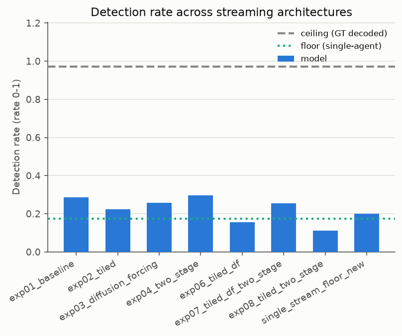
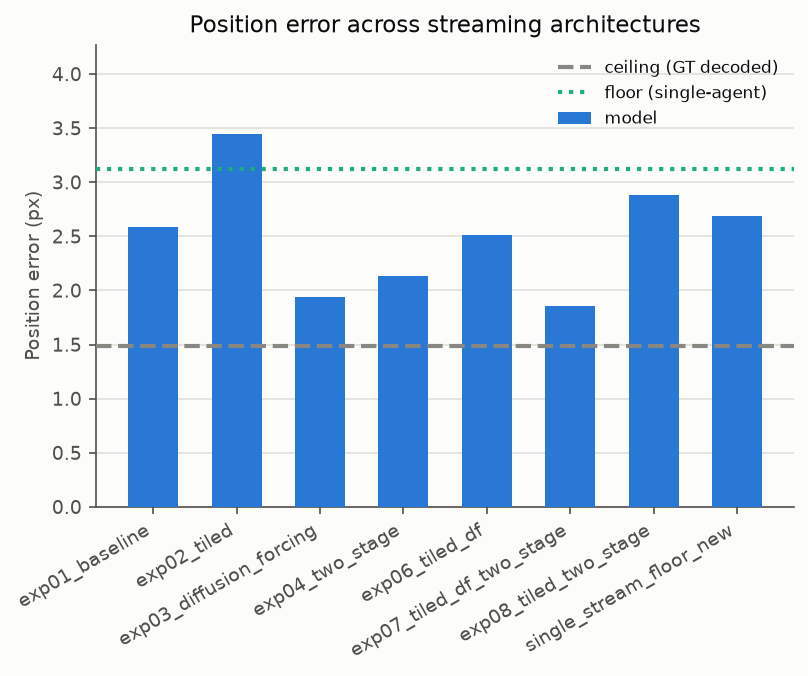
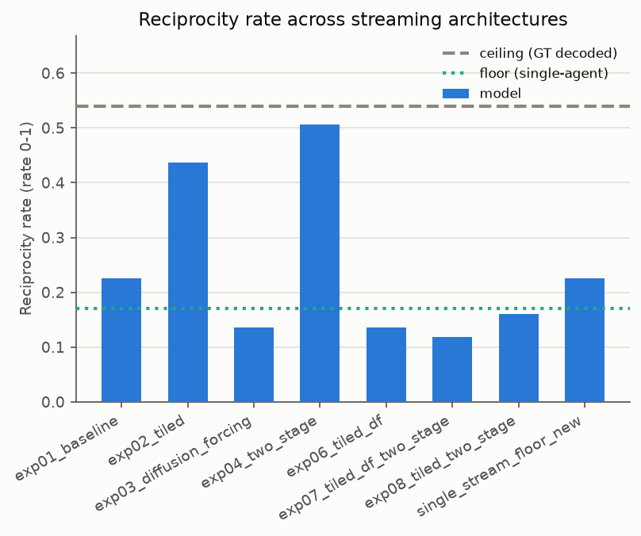
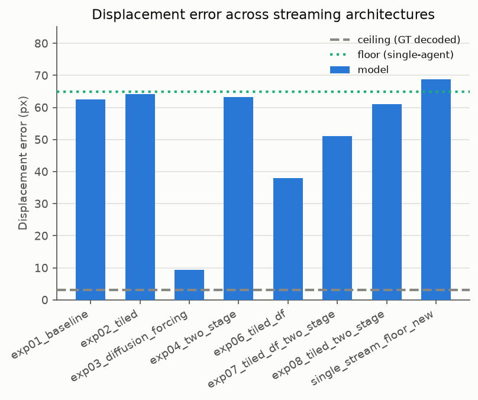
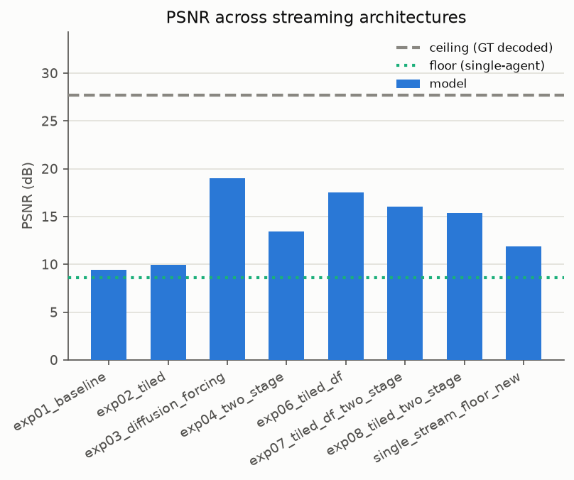
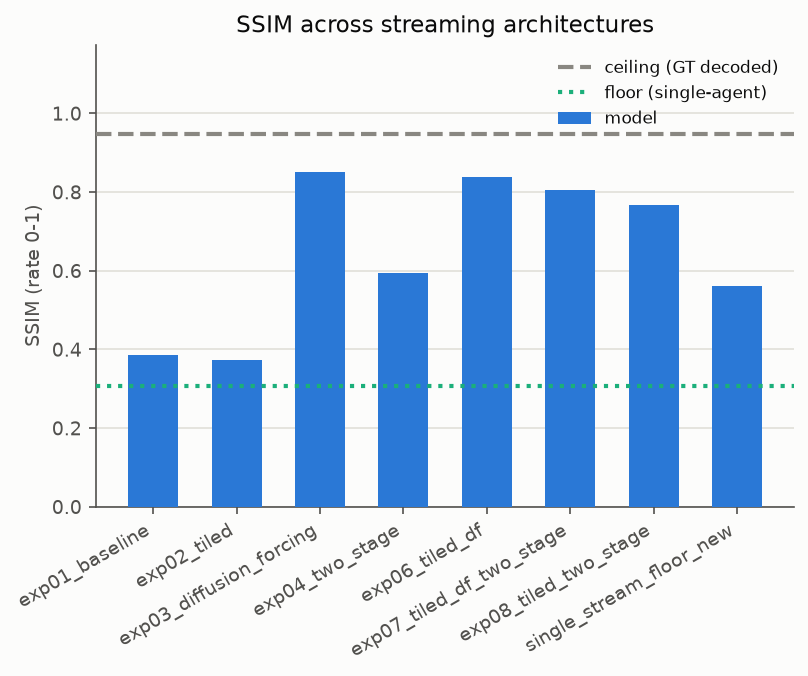

Full per-experiment tables (ceiling / model / baseline=exp04-stage1-floor):
[`tables/streaming_arch.md`](tables/streaming_arch.md).

**Read at 10s/50-step full fidelity (vs. the reduced 6s/25-step pass):** detection
rate is roughly stable for most experiments (e.g. exp01 0.282→0.286, exp03
0.278→0.257) but volume exploded for several (exp01 `n_sightings` 3726→27716 at
6x the episode-seconds — expected, more frames — but `mean_detected_per_frame`
also roughly doubled or more for exp01/exp02/exp04/exp07/exp08, suggesting these
architectures accumulate spurious detections as the rollout runs longer). The two
diffusion-forcing variants (`exp03`, `exp06`) again land closest to ceiling on
displacement error (9.4px, 38.0px vs 3.1px ceiling — note exp06's gap widened a lot
vs the reduced pass's 9.0px, worth another look) and PSNR/SSIM, but `exp06` again
has a low detection rate (0.157, second-worst of the 8). `exp08_tiled_two_stage` has
the *worst* detection rate at full fidelity (0.111, worse than the reduced pass's
0.147) — tiled variants continue to underperform `exp01_baseline` on detection.
`exp04_two_stage` again has the best detection rate (0.296). The new
`single_stream_floor_new` column (0.200 detection, 0.563 SSIM) actually slightly
**beats** the old exp04-stage1 floor (0.174 detection, 0.306 SSIM) it sits next to —
tentative evidence the new dedicated single-agent model is a better floor than the
repurposed stage-1 pretrain, worth considering as a future floor swap. All of this
is n=6 episodes — better than the reduced pass's n=3, but still not large-sample.

## Group 2 — Agent-count scaling sweep (`agentcount`, N=2,5,8,10,20,30)

Baseline (`single_stream_floor_new`) is now present for **every** N, including
20/30 (dropped in the reduced pass for time). N=10's ceiling (0.972/1.490/0.948)
matches Group 1's exactly.

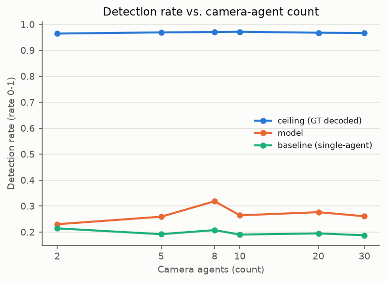
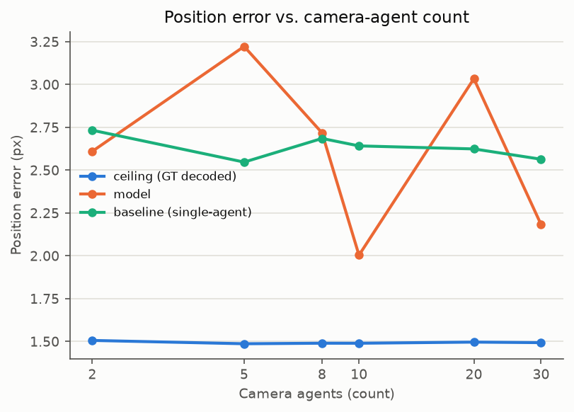
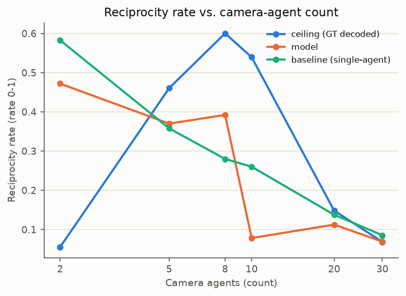
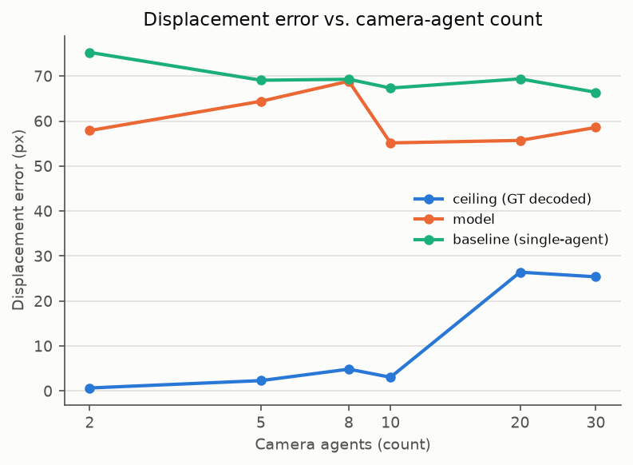
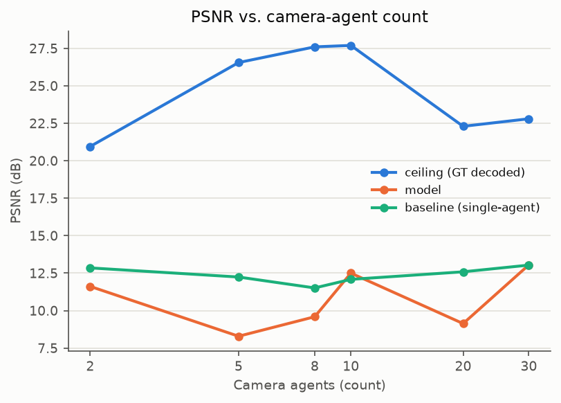
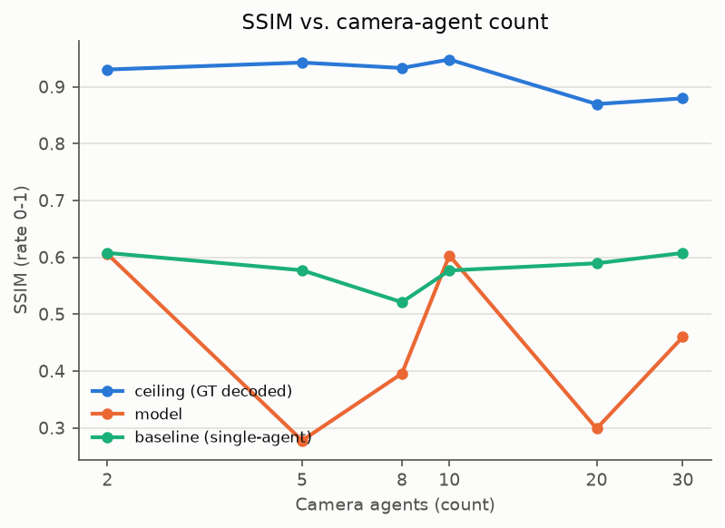

Full per-N tables: [`tables/agentcount.md`](tables/agentcount.md).

**Read:** detection rate stays in a fairly narrow band across N=2→30 (0.23–0.32),
consistent with the reduced pass's read that per-view fidelity doesn't obviously
degrade with more cameras. With baseline now available at every N: the model beats
the single-agent baseline on detection rate at every N (e.g. 0.319 vs 0.208 at N=8),
but reciprocity is a mixed bag — model beats baseline at N=8/10 (0.392 vs 0.280,
0.078 vs 0.260 — actually *loses* at N=10) but loses at N=2/5/20/30. No clean
monotonic story on reciprocity vs. camera count at this sample size; would want
more episodes or a dedicated ablation to say anything confident.

## Group 3 — Color + gradient background (`color_bg`, no domain-matched floor)

No single-agent baseline under matching (gradient-background, color_bg VAE)
conditions — ceiling/model only, same as the reduced pass.

Table: [`tables/color_bg.md`](tables/color_bg.md).

**Read:** detection rate 0.953→0.194 (ceiling→model), SSIM 0.953→0.496. Directionally
similar gap to `exp01_baseline` under the plain background (0.972→0.286, 0.948→0.386
SSIM) — still no strong evidence the gradient background makes rollout quality
dramatically worse, though detection rate here is a bit lower than exp01's model
column. Still no matched floor to confirm this against.

## Reproducing / extending this sweep

```bash
cd /home/wyunzhe/projects/flockworld
bash jobs/eval_sweep_20260809/run_local_full_sweep.sh   # re-runs all 8; edit EPISODES/SECONDS_/STEPS at the top to change fidelity
uv run python jobs/eval_sweep_20260809/adapt_streaming_arch_json.py \
  eval_results/20260809_full_fidelity/results/streaming_arch/comparison.json
uv run python plot_eval_sweep.py \
  --results-dir eval_results/20260809_full_fidelity/results \
  --plots-dir eval_results/20260809_full_fidelity/plots \
  --tables-dir eval_results/20260809_full_fidelity/tables
```

The `adapt_streaming_arch_json.py` step is only needed for the `streaming_arch`
group: `compare_experiments.py` evaluates all 7 experiments (+floor+extra) in ONE
combined `comparison.json` (shares the held-out dataset build across columns, faster
than 9 separate `eval_flock_multi.py` processes); the adapter splits that into the
one-file-per-experiment shape `plot_eval_sweep.py` expects. `agentcount` and
`color_bg` already write directly in that shape (unchanged from the reduced pass).

To re-run with different models: edit `EXPERIMENTS` in `compare_experiments.py`
(streaming_arch) or the `run_agentcount`/color_bg calls in
`jobs/eval_sweep_20260809/run_local_full_sweep.sh`.

## File manifest

```
eval_results/20260809_full_fidelity/
  REPORT.md                      this file
  results/streaming_arch/
    comparison.json               combined 8-column result (ceiling+floor+7 exps+extra)
    comparison.csv                per-episode tidy CSV, ALL 8 columns x 6 episodes x every metric
    <expname>.json                 per-experiment view, generated by adapt_streaming_arch_json.py
  results/agentcount/<tag>.json/.csv    one pair per N (2,5,8,10,20,30) -- .csv is per-episode
  results/color_bg/color_bg_multi.json/.csv
  plots/*.png                    12 PNGs (agentcount x6 metrics, streaming_arch x6 metrics)
  tables/*.md                    per-group markdown tables (mirrors the inlined reads above)
output/flockdit_streaming_20260809/
  single_stream_floor/            new dedicated single-agent floor checkpoint (informational column)
  multi_stream_color_bg/          new gradient-background multi-agent checkpoint
  eval_logs/                     full stdout/stderr per run + _master.log (timing/pass-fail)
  eval_videos/streaming_arch_full/   overlay rollout mp4s, 2 episodes x 9 columns
jobs/eval_sweep_20260809/
  run_local_full_sweep.sh         the sweep driver used for this pass (local, no SLURM)
  adapt_streaming_arch_json.py    comparison.json -> per-experiment json adapter
  run_eval_sweep.sh               original SLURM-oriented driver (unchanged; still usable on-cluster)
plot_eval_sweep.py                 plotting + table generator (repo root; now also skips non-
                                    per-experiment json files defensively, e.g. comparison.json)
compare_experiments.py             now supports --save-json / --save-csv / --extra-single-agent-*
eval_flock_multi.py                now supports --save-csv (per-episode)
eval_flock_dit.py                  find_best_checkpoint now falls back to newest step_*.pt (nan
                                    val_loss) when no scored epoch_*.pt exists
```
