# FlockDiT evaluation sweep — 2026-08-09

Full-coverage evaluation pass over every checkpoint we currently have with usable
`epoch_*.pt` checkpoints: the 7-way streaming-architecture ablation
(`flockdit_streaming_20260715`), the 6-point agent-count scaling sweep
(`agentcount_20260804`), and the color+gradient-background run
(`flock_dit_multi_stream_color_bg`) — 14 evaluations total, run on one A100 via
`jobs/eval_sweep_20260809/run_eval_sweep.sh`.

**Read this before the numbers below:** this pass ran inside an interactive SLURM
allocation with a hard ~90-minute wall-clock budget, not a full `sbatch` job. To
fit, eval settings were reduced from `eval_flock_multi.py`'s defaults
(6 episodes / 10s / 50 Euler steps) to **3 episodes / 6s / 25 steps**, and the
single-agent floor baseline was dropped for the 7 architecture-ablation runs and
for `agentcount` N=20/30 (its rollout cost scales linearly with camera-agent
count — running it there would have alone exceeded the time box). Treat every
number here as **directional, not final-precision** — n=3 episodes is noisy. The
infrastructure (this script + `--save-json` + `plot_eval_sweep.py`) is now in
place to re-run at full fidelity in a longer session; see "Reproducing / extending"
below.

## Methodology recap

Each evaluation rolls out held-out streaming episodes and reports three column
types, averaged over episodes:

- **ceiling** — GT latents decoded directly (VAE + detector noise only, no model
  rollout). Best achievable.
- **model** — the actual trained checkpoint's autoregressive rollout.
- **baseline** — an independent single-agent model rolled out per camera view
  (the "why not just run N solo models" floor). Present only where noted above.

Three metric families (see `modeling/eval/{consistency,pair_consistency}.py`):
**Tier A** (GT-anchored: detection rate, position error), **cross-view
consistency** (GT-free: do independent camera views agree with each other —
reciprocity, displacement/motion error), and **pixel similarity** (GT-free PSNR/SSIM
on warped-overlap regions). Rates and errors are only meaningful read against the
"volume" they're computed over (a near-empty rollout trivially scores well) — the
volume/context rows are included in every table below for that reason.

One VAE checkpoint path had moved since training (`pretrained/color_bg/` →
`pretrained/color_bg_stream/`, same file) — fixed in the sweep script before the
color_bg run.

## Group 1 — Streaming architecture ablation (`streaming_arch`, num_agents=10 fixed)

Ceiling is identical across all 7 (0.975 detection / 1.482px / 0.943 SSIM) —
expected and a useful sanity check: same P=10, same sim overrides, same
`eval_seed=0` ⇒ bit-identical held-out episodes every time, and it also matches
the agent-count sweep's own N=10 ceiling below exactly.

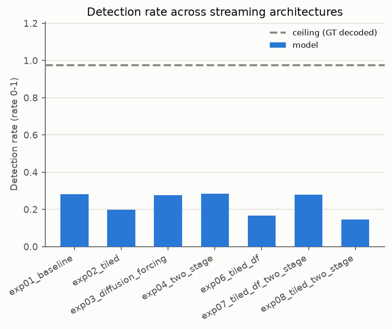
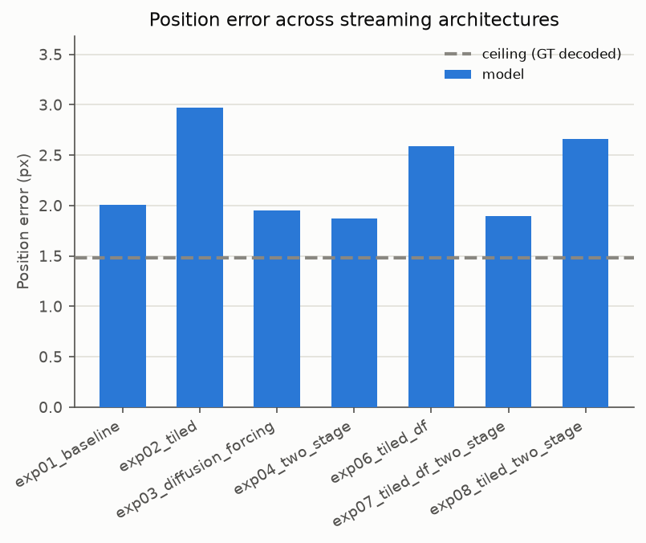
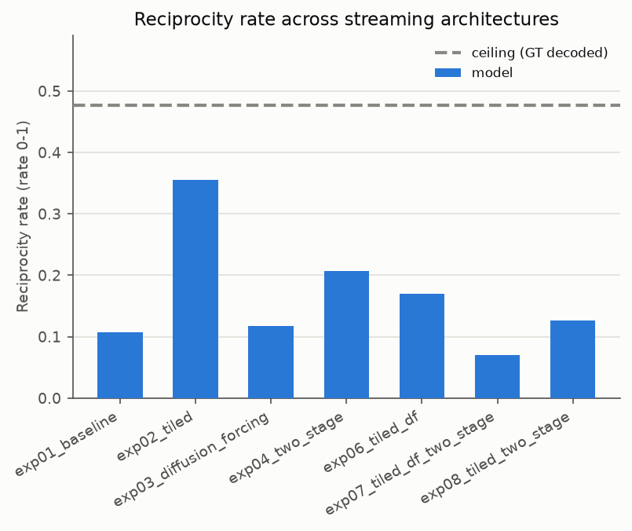
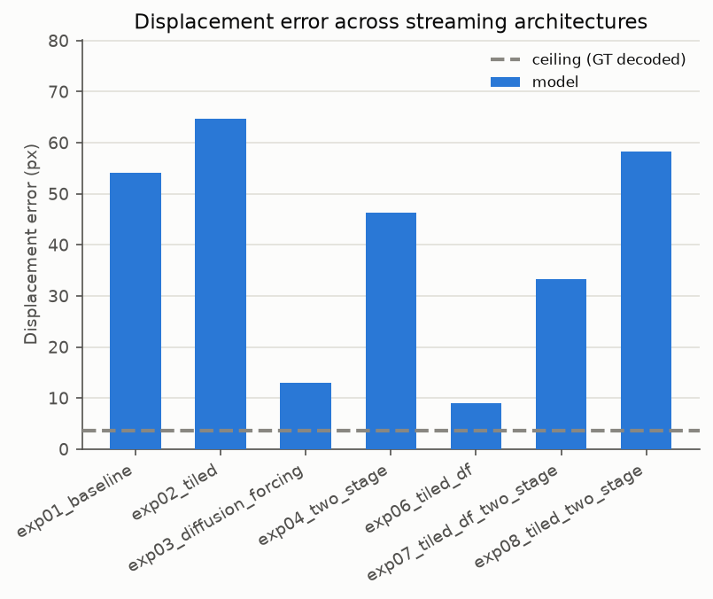
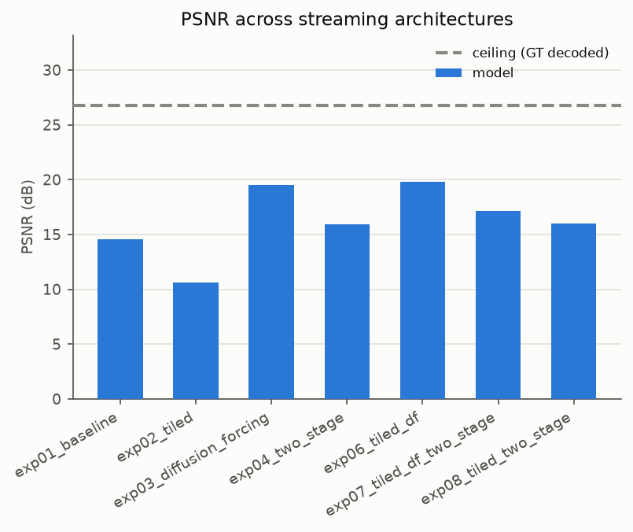
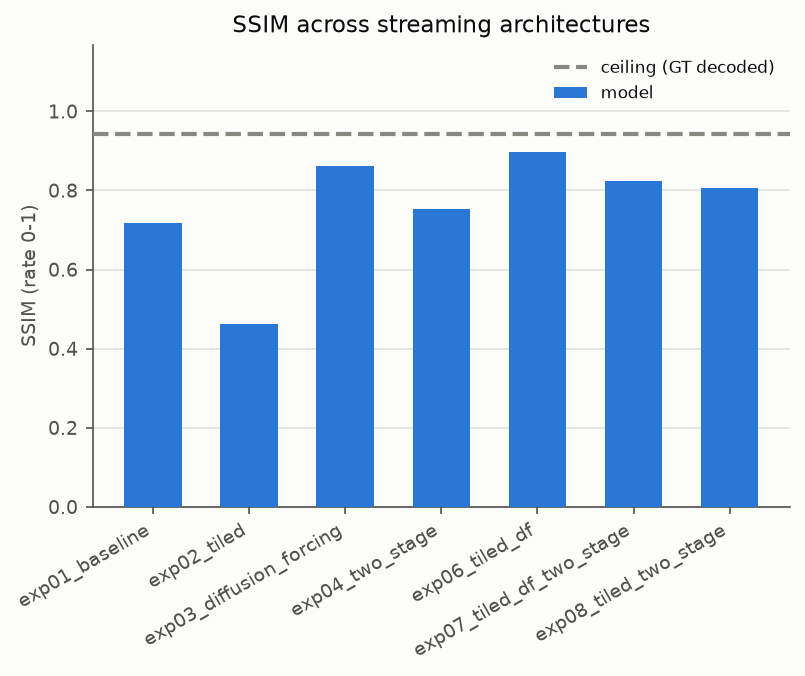

### exp01_baseline

**Quality metrics**

| metric | ceiling | model |
|---|---|---|
| Detection rate (up) | 0.975 | 0.282 |
| Position error px (down) | 1.482 | 2.009 |
| Reciprocity rate (up) | 0.477 | 0.107 |
| Displacement error px (down) | 3.687 | 54.035 |
| PSNR dB (up) | 26.765 | 14.582 |
| SSIM (up) | 0.943 | 0.718 |

**Volume / context (not a quality metric)**

| metric | ceiling | model |
|---|---|---|
| Detections / frame (volume) | 5.324 | 5.276 |
| GT boids visible / frame (volume) | 5.445 | 5.445 |
| Sightings / pair-frame (volume) | 0.047 | 0.156 |
| n_sightings (volume) | 1118 | 3726 |
| n_reciprocal (volume) | 272 | 201 |
| n_matched_white (volume) | 942 | 176 |
| n_overlap_white (volume) | 1022 | 859 |
| n_pixel_events (volume) | 272 | 201 |

### exp02_tiled

**Quality metrics**

| metric | ceiling | model |
|---|---|---|
| Detection rate (up) | 0.975 | 0.199 |
| Position error px (down) | 1.482 | 2.972 |
| Reciprocity rate (up) | 0.477 | 0.355 |
| Displacement error px (down) | 3.687 | 64.704 |
| PSNR dB (up) | 26.765 | 10.614 |
| SSIM (up) | 0.943 | 0.462 |

**Volume / context (not a quality metric)**

| metric | ceiling | model |
|---|---|---|
| Detections / frame (volume) | 5.324 | 11.963 |
| GT boids visible / frame (volume) | 5.445 | 5.445 |
| Sightings / pair-frame (volume) | 0.047 | 0.496 |
| n_sightings (volume) | 1118 | 11850 |
| n_reciprocal (volume) | 272 | 2132 |
| n_matched_white (volume) | 942 | 1110 |
| n_overlap_white (volume) | 1022 | 13883 |
| n_pixel_events (volume) | 272 | 2132 |

### exp03_diffusion_forcing

**Quality metrics**

| metric | ceiling | model |
|---|---|---|
| Detection rate (up) | 0.975 | 0.278 |
| Position error px (down) | 1.482 | 1.948 |
| Reciprocity rate (up) | 0.477 | 0.118 |
| Displacement error px (down) | 3.687 | 12.910 |
| PSNR dB (up) | 26.765 | 19.514 |
| SSIM (up) | 0.943 | 0.862 |

**Volume / context (not a quality metric)**

| metric | ceiling | model |
|---|---|---|
| Detections / frame (volume) | 5.324 | 3.886 |
| GT boids visible / frame (volume) | 5.445 | 5.445 |
| Sightings / pair-frame (volume) | 0.047 | 0.040 |
| n_sightings (volume) | 1118 | 954 |
| n_reciprocal (volume) | 272 | 56 |
| n_matched_white (volume) | 942 | 130 |
| n_overlap_white (volume) | 1022 | 191 |
| n_pixel_events (volume) | 272 | 56 |

### exp04_two_stage

**Quality metrics**

| metric | ceiling | model |
|---|---|---|
| Detection rate (up) | 0.975 | 0.285 |
| Position error px (down) | 1.482 | 1.871 |
| Reciprocity rate (up) | 0.477 | 0.207 |
| Displacement error px (down) | 3.687 | 46.356 |
| PSNR dB (up) | 26.765 | 15.900 |
| SSIM (up) | 0.943 | 0.754 |

**Volume / context (not a quality metric)**

| metric | ceiling | model |
|---|---|---|
| Detections / frame (volume) | 5.324 | 4.248 |
| GT boids visible / frame (volume) | 5.445 | 5.445 |
| Sightings / pair-frame (volume) | 0.047 | 0.165 |
| n_sightings (volume) | 1118 | 3949 |
| n_reciprocal (volume) | 272 | 416 |
| n_matched_white (volume) | 942 | 212 |
| n_overlap_white (volume) | 1022 | 845 |
| n_pixel_events (volume) | 272 | 416 |

### exp06_tiled_df

**Quality metrics**

| metric | ceiling | model |
|---|---|---|
| Detection rate (up) | 0.975 | 0.166 |
| Position error px (down) | 1.482 | 2.586 |
| Reciprocity rate (up) | 0.477 | 0.170 |
| Displacement error px (down) | 3.687 | 8.994 |
| PSNR dB (up) | 26.765 | 19.778 |
| SSIM (up) | 0.943 | 0.898 |

**Volume / context (not a quality metric)**

| metric | ceiling | model |
|---|---|---|
| Detections / frame (volume) | 5.324 | 3.759 |
| GT boids visible / frame (volume) | 5.445 | 5.445 |
| Sightings / pair-frame (volume) | 0.047 | 0.029 |
| n_sightings (volume) | 1118 | 701 |
| n_reciprocal (volume) | 272 | 51 |
| n_matched_white (volume) | 942 | 142 |
| n_overlap_white (volume) | 1022 | 174 |
| n_pixel_events (volume) | 272 | 51 |

### exp07_tiled_df_two_stage

**Quality metrics**

| metric | ceiling | model |
|---|---|---|
| Detection rate (up) | 0.975 | 0.279 |
| Position error px (down) | 1.482 | 1.899 |
| Reciprocity rate (up) | 0.477 | 0.070 |
| Displacement error px (down) | 3.687 | 33.358 |
| PSNR dB (up) | 26.765 | 17.167 |
| SSIM (up) | 0.943 | 0.824 |

**Volume / context (not a quality metric)**

| metric | ceiling | model |
|---|---|---|
| Detections / frame (volume) | 5.324 | 4.204 |
| GT boids visible / frame (volume) | 5.445 | 5.445 |
| Sightings / pair-frame (volume) | 0.047 | 0.120 |
| n_sightings (volume) | 1118 | 2873 |
| n_reciprocal (volume) | 272 | 95 |
| n_matched_white (volume) | 942 | 119 |
| n_overlap_white (volume) | 1022 | 235 |
| n_pixel_events (volume) | 272 | 95 |

### exp08_tiled_two_stage

**Quality metrics**

| metric | ceiling | model |
|---|---|---|
| Detection rate (up) | 0.975 | 0.147 |
| Position error px (down) | 1.482 | 2.663 |
| Reciprocity rate (up) | 0.477 | 0.126 |
| Displacement error px (down) | 3.687 | 58.298 |
| PSNR dB (up) | 26.765 | 16.014 |
| SSIM (up) | 0.943 | 0.806 |

**Volume / context (not a quality metric)**

| metric | ceiling | model |
|---|---|---|
| Detections / frame (volume) | 5.324 | 4.850 |
| GT boids visible / frame (volume) | 5.445 | 5.445 |
| Sightings / pair-frame (volume) | 0.047 | 0.204 |
| n_sightings (volume) | 1118 | 4868 |
| n_reciprocal (volume) | 272 | 319 |
| n_matched_white (volume) | 942 | 164 |
| n_overlap_white (volume) | 1022 | 953 |
| n_pixel_events (volume) | 272 | 319 |

**Preliminary read (n=3 episodes — noisy, do not over-index):** the two
diffusion-forcing variants (`exp03`, `exp06`) come noticeably closer to ceiling
on displacement error (12.9px, 9.0px vs. ~3.7px ceiling, vs. 33-64px for the
non-DF variants) and SSIM (0.86, 0.90 vs. ceiling 0.94), but `exp06`
(tiled+DF combined) has the *worst* detection rate of the set (0.166) —
plausibly a smoother/blurrier rollout that reads as more pixel-similar to
ceiling without crisply rendering dart shapes the detector can pick up. Every
tiled variant (`exp02`, `exp06`, `exp08`) scores below `exp01_baseline` on
detection rate. `exp04_two_stage` has the best detection rate of the 7
(0.285, edging out the from-scratch baseline). None of this is confirmed at
this sample size.

## Group 2 — Agent-count scaling sweep (`agentcount`, N=2,5,8,10,20,30)

Baseline present for N≤10 only (dropped for N=20/30 — cost scales with camera
count). N=10's ceiling matches Group 1's exactly (see above), confirming
determinism across the two independently-launched subprocess runs.

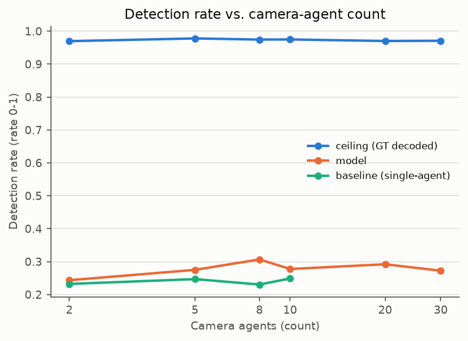
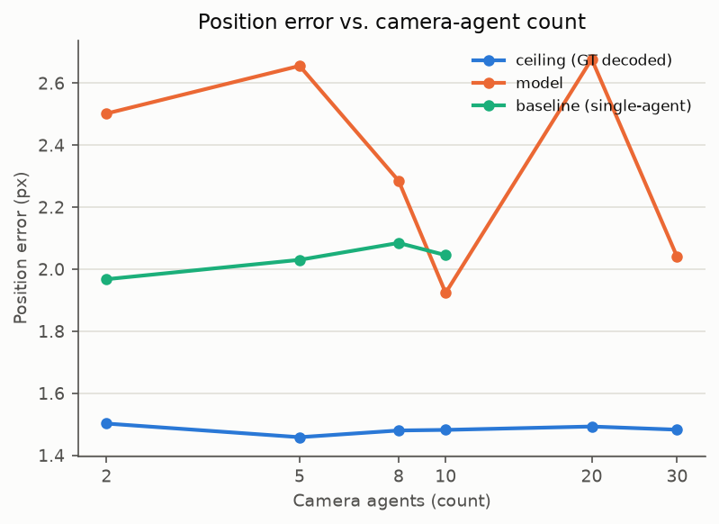
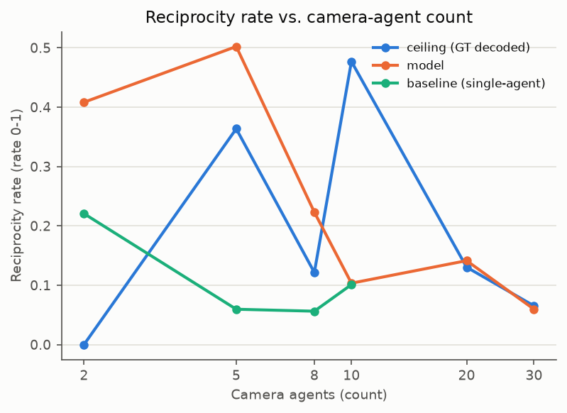
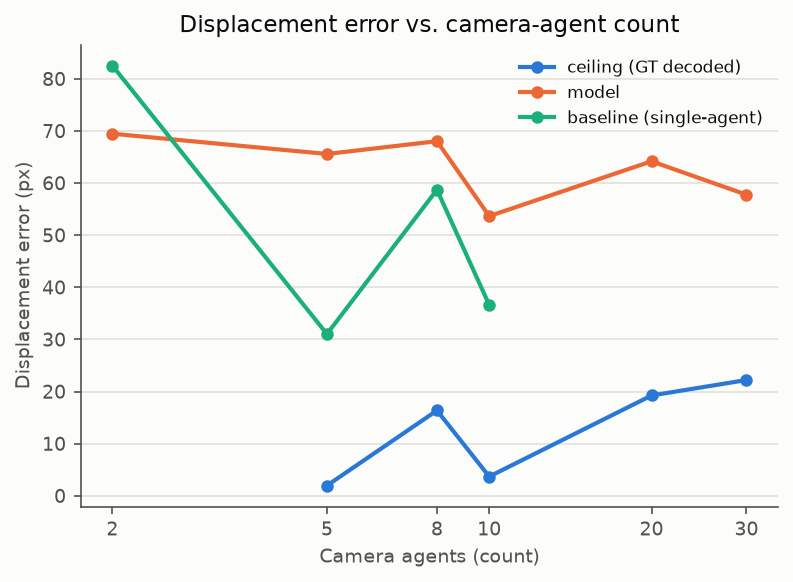
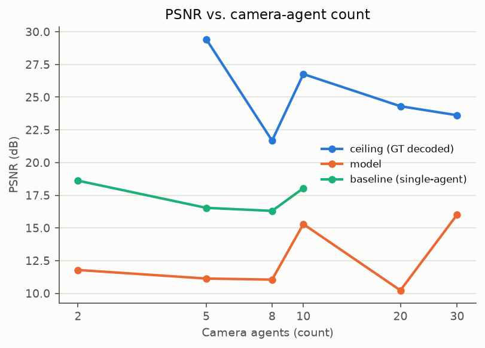
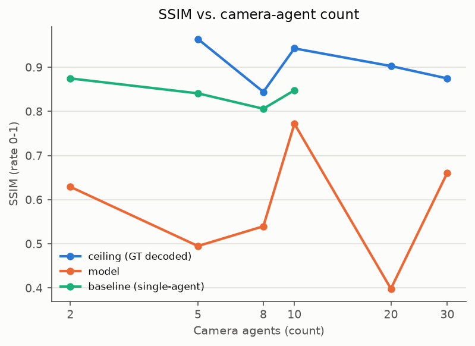

### num_agents = 2

**Quality metrics**

| metric | ceiling | model | baseline |
|---|---|---|---|
| Detection rate (up) | 0.970 | 0.243 | 0.232 |
| Position error px (down) | 1.502 | 2.502 | 1.968 |
| Reciprocity rate (up) | 0.000 | 0.408 | 0.221 |
| Displacement error px (down) | – | 69.462 | 82.533 |
| PSNR dB (up) | – | 11.785 | 18.615 |
| SSIM (up) | – | 0.629 | 0.875 |

**Volume / context (not a quality metric)**

| metric | ceiling | model | baseline |
|---|---|---|---|
| Detections / frame (volume) | 6.085 | 8.593 | 3.780 |
| GT boids visible / frame (volume) | 6.200 | 6.200 | 6.200 |
| Sightings / pair-frame (volume) | 0.000 | 0.778 | 0.527 |
| n_sightings (volume) | 0 | 413 | 280 |
| n_reciprocal (volume) | 0 | 108 | 43 |
| n_matched_white (volume) | 0 | 62 | 0 |
| n_overlap_white (volume) | 0 | 768 | 43 |
| n_pixel_events (volume) | 0 | 108 | 43 |

### num_agents = 5

**Quality metrics**

| metric | ceiling | model | baseline |
|---|---|---|---|
| Detection rate (up) | 0.978 | 0.275 | 0.247 |
| Position error px (down) | 1.458 | 2.656 | 2.030 |
| Reciprocity rate (up) | 0.364 | 0.502 | 0.060 |
| Displacement error px (down) | 1.954 | 65.576 | 31.030 |
| PSNR dB (up) | 29.431 | 11.130 | 16.536 |
| SSIM (up) | 0.964 | 0.495 | 0.841 |

**Volume / context (not a quality metric)**

| metric | ceiling | model | baseline |
|---|---|---|---|
| Detections / frame (volume) | 5.435 | 12.795 | 2.971 |
| GT boids visible / frame (volume) | 5.496 | 5.496 | 5.496 |
| Sightings / pair-frame (volume) | 0.074 | 0.791 | 0.138 |
| n_sightings (volume) | 395 | 4201 | 735 |
| n_reciprocal (volume) | 72 | 1084 | 23 |
| n_matched_white (volume) | 192 | 568 | 51 |
| n_overlap_white (volume) | 202 | 8352 | 75 |
| n_pixel_events (volume) | 72 | 1084 | 23 |

### num_agents = 8

**Quality metrics**

| metric | ceiling | model | baseline |
|---|---|---|---|
| Detection rate (up) | 0.975 | 0.307 | 0.230 |
| Position error px (down) | 1.480 | 2.285 | 2.085 |
| Reciprocity rate (up) | 0.122 | 0.223 | 0.056 |
| Displacement error px (down) | 16.362 | 68.025 | 58.712 |
| PSNR dB (up) | 21.678 | 11.048 | 16.303 |
| SSIM (up) | 0.844 | 0.540 | 0.806 |

**Volume / context (not a quality metric)**

| metric | ceiling | model | baseline |
|---|---|---|---|
| Detections / frame (volume) | 5.347 | 11.011 | 2.868 |
| GT boids visible / frame (volume) | 5.463 | 5.463 | 5.463 |
| Sightings / pair-frame (volume) | 0.029 | 0.398 | 0.101 |
| n_sightings (volume) | 427 | 5923 | 1497 |
| n_reciprocal (volume) | 34 | 677 | 48 |
| n_matched_white (volume) | 71 | 278 | 8 |
| n_overlap_white (volume) | 115 | 4467 | 70 |
| n_pixel_events (volume) | 34 | 677 | 48 |

### num_agents = 10

**Quality metrics**

| metric | ceiling | model | baseline |
|---|---|---|---|
| Detection rate (up) | 0.975 | 0.278 | 0.249 |
| Position error px (down) | 1.482 | 1.924 | 2.045 |
| Reciprocity rate (up) | 0.477 | 0.103 | 0.101 |
| Displacement error px (down) | 3.687 | 53.653 | 36.604 |
| PSNR dB (up) | 26.765 | 15.294 | 18.038 |
| SSIM (up) | 0.943 | 0.772 | 0.848 |

**Volume / context (not a quality metric)**

| metric | ceiling | model | baseline |
|---|---|---|---|
| Detections / frame (volume) | 5.324 | 4.923 | 3.405 |
| GT boids visible / frame (volume) | 5.445 | 5.445 | 5.445 |
| Sightings / pair-frame (volume) | 0.047 | 0.127 | 0.126 |
| n_sightings (volume) | 1118 | 3040 | 3006 |
| n_reciprocal (volume) | 272 | 163 | 155 |
| n_matched_white (volume) | 942 | 171 | 168 |
| n_overlap_white (volume) | 1022 | 662 | 343 |
| n_pixel_events (volume) | 272 | 163 | 155 |

### num_agents = 20 (no baseline — see time-box note above)

**Quality metrics**

| metric | ceiling | model |
|---|---|---|
| Detection rate (up) | 0.970 | 0.292 |
| Position error px (down) | 1.493 | 2.678 |
| Reciprocity rate (up) | 0.130 | 0.141 |
| Displacement error px (down) | 19.240 | 64.173 |
| PSNR dB (up) | 24.308 | 10.228 |
| SSIM (up) | 0.903 | 0.398 |

**Volume / context (not a quality metric)**

| metric | ceiling | model |
|---|---|---|
| Detections / frame (volume) | 5.119 | 12.412 |
| GT boids visible / frame (volume) | 5.272 | 5.272 |
| Sightings / pair-frame (volume) | 0.054 | 0.221 |
| n_sightings (volume) | 5432 | 22296 |
| n_reciprocal (volume) | 338 | 1589 |
| n_matched_white (volume) | 423 | 1618 |
| n_overlap_white (volume) | 739 | 15053 |
| n_pixel_events (volume) | 338 | 1589 |

### num_agents = 30 (no baseline — see time-box note above)

**Quality metrics**

| metric | ceiling | model |
|---|---|---|
| Detection rate (up) | 0.971 | 0.272 |
| Position error px (down) | 1.483 | 2.040 |
| Reciprocity rate (up) | 0.065 | 0.060 |
| Displacement error px (down) | 22.205 | 57.759 |
| PSNR dB (up) | 23.617 | 16.022 |
| SSIM (up) | 0.875 | 0.661 |

**Volume / context (not a quality metric)**

| metric | ceiling | model |
|---|---|---|
| Detections / frame (volume) | 5.198 | 5.154 |
| GT boids visible / frame (volume) | 5.335 | 5.335 |
| Sightings / pair-frame (volume) | 0.042 | 0.083 |
| n_sightings (volume) | 9695 | 19146 |
| n_reciprocal (volume) | 314 | 575 |
| n_matched_white (volume) | 338 | 200 |
| n_overlap_white (volume) | 687 | 1553 |
| n_pixel_events (volume) | 314 | 575 |

**Preliminary read (n=3 episodes — noisy):** detection rate and position error
stay roughly flat across N=2→30 (0.24-0.31 detection, 1.9-2.7px), i.e. no
strong evidence of per-view fidelity degrading as more cameras are added, at
least in this sample. Model reciprocity peaks around N=5 (0.502) and drops off
by N=10+ (0.10-0.14), suggesting cross-view *agreement* gets harder to
maintain as the camera count grows past ~8, even though single-view fidelity
doesn't obviously suffer. Model clearly beats the single-agent baseline on
reciprocity at N=2, 5, 8 (e.g. 0.502 vs. 0.060 at N=5) but is roughly tied with
it by N=10 (0.103 vs. 0.101) — tentative evidence the cross-attention
advantage over independent single-agent rollouts shrinks as N grows toward 10.
PSNR/SSIM don't show a clean monotonic trend at this sample size — would need
more episodes to separate signal from noise.

## Group 3 — Color + gradient background (`color_bg`, no domain-matched floor)

No single-agent baseline is available under matching (gradient-background,
color_bg VAE) conditions, so this is ceiling/model only.

### color_bg_multi

**Quality metrics**

| metric | ceiling | model |
|---|---|---|
| Detection rate (up) | 0.962 | 0.267 |
| Position error px (down) | 1.494 | 2.351 |
| Reciprocity rate (up) | 0.717 | 0.213 |
| Displacement error px (down) | 2.526 | 55.913 |
| PSNR dB (up) | 28.103 | 13.023 |
| SSIM (up) | 0.946 | 0.487 |

**Volume / context (not a quality metric)**

| metric | ceiling | model |
|---|---|---|
| Detections / frame (volume) | 5.251 | 7.270 |
| GT boids visible / frame (volume) | 5.445 | 5.445 |
| Sightings / pair-frame (volume) | 0.073 | 0.247 |
| n_sightings (volume) | 1742 | 5902 |
| n_reciprocal (volume) | 633 | 645 |
| n_matched_white (volume) | 1992 | 374 |
| n_overlap_white (volume) | 2121 | 3062 |
| n_pixel_events (volume) | 633 | 645 |

**Preliminary read:** the ceiling-to-model gap here (detection 0.962→0.267,
SSIM 0.946→0.487) is roughly the same order as `exp01_baseline`'s gap under the
plain black-background condition (0.975→0.282, 0.943→0.718 SSIM) — no evidence
in this single run that the gradient background makes rollout quality
dramatically worse, though SSIM is more degraded here (0.487 vs. 0.718),
possibly reflecting the harder gradient-background reconstruction task. No
matched floor to confirm this against.

## Reproducing / extending this sweep

Full-fidelity re-run (defaults: 6 episodes / 10s / 50 steps, all baselines
included) needs a much longer allocation — see the time-cost note at the top.
To re-run:

```bash
cd /path/to/flockworld
SWEEP_ID=<new_id> EPISODES=6 SECONDS_=10 STEPS=50 \
  bash jobs/eval_sweep_20260809/run_eval_sweep.sh all
uv run python plot_eval_sweep.py \
  --results-dir eval_results/<new_id>/results \
  --plots-dir eval_results/<new_id>/plots \
  --tables-dir eval_results/<new_id>/tables
```

Individual groups can be re-run in isolation via `... run_eval_sweep.sh
{streaming_arch,agentcount,color_bg}`. `ARCH_BASELINE=single` re-enables the
floor baseline for the architecture-ablation group (expensive — budget
accordingly); `SKIP_LARGE_BASELINE=1` (default unset) skips it for
agentcount N=20/30.

## File manifest

```
eval_results/20260809_full_sweep/
  REPORT.md              this file
  results/<group>/*.json raw --save-json output, one per experiment
  plots/*.png             12 PNGs (agentcount x6 metrics, streaming_arch x6 metrics)
  tables/*.md             per-group markdown tables (same content as inlined above)
  logs/*.log              full stdout/stderr per experiment run
jobs/eval_sweep_20260809/run_eval_sweep.sh   the sweep driver script
plot_eval_sweep.py                            plotting + table generator (repo root)
```

Checkpoints and training logs referenced here live on `/path/to/flockworld-storage/output/`
(see `docs/experiment_log/2026-07-15_streaming_flockdit_slurm.md` for the
architecture-ablation training matrix, and `jobs/agentcount_20260804/agentcount.job`
for the agent-count sweep's training config).
